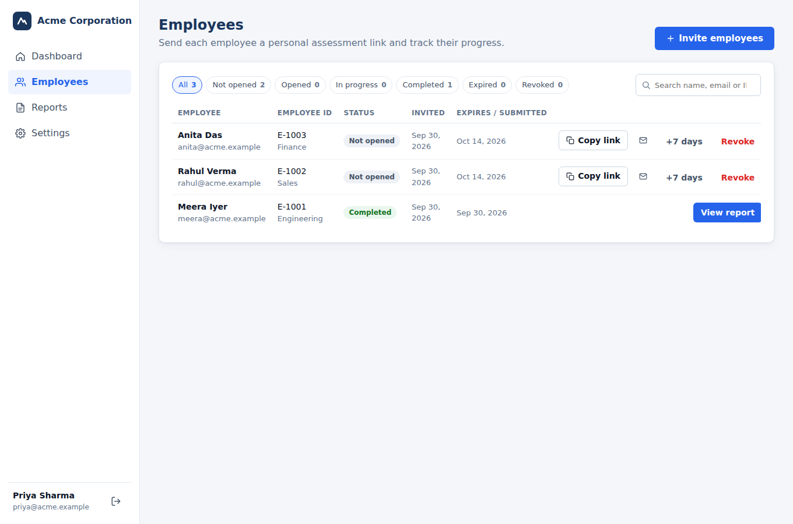
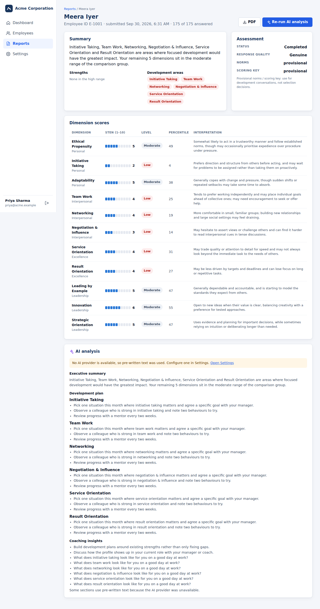
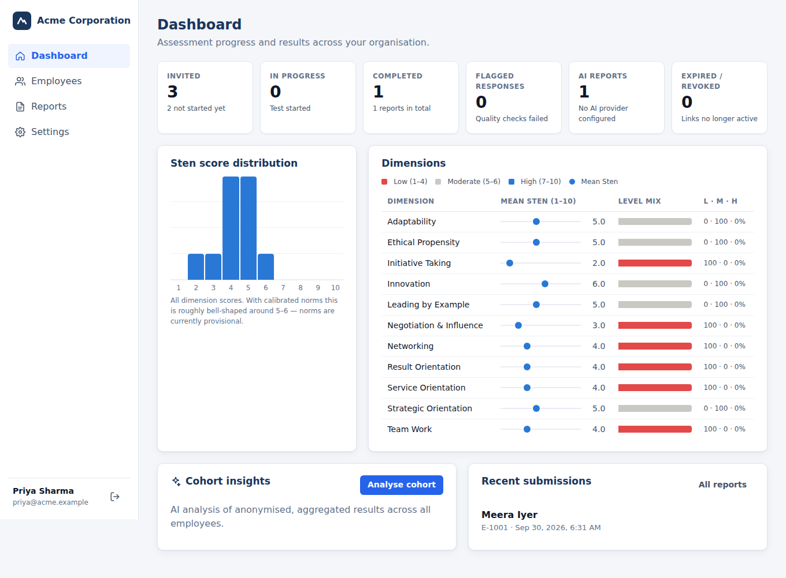
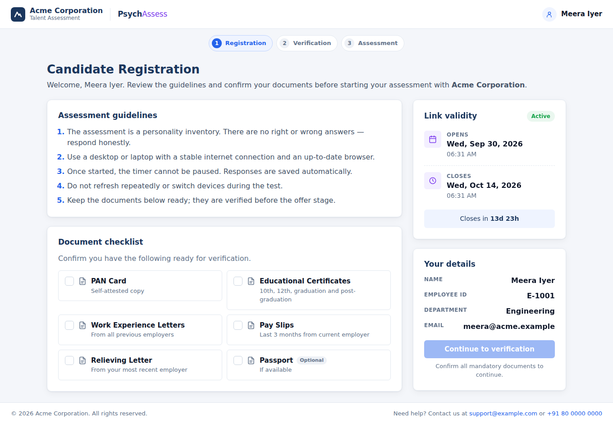
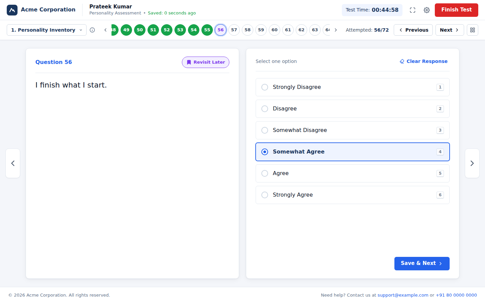
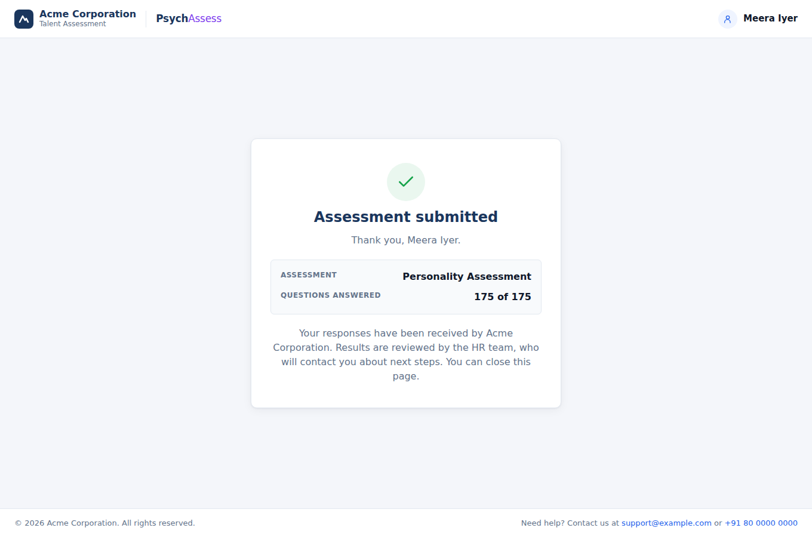

# Psychometric Assessment Platform

An online personality-assessment platform with two sides:

- **Admin console** (`/admin`): admins sign in, create a personal assessment link for each employee (one at a time or pasted in bulk), track who has opened, started and completed it, and read each employee's report, with optional AI analysis, PDF export and cohort analytics.
- **Employee test** (`/t/<link>`): the employee opens their link and goes through registration, system and keyboard verification, and the timed 175-question test, then sees a "submitted" confirmation. **Employees never see scores; reports exist only in the admin account.**

The frontend is React + TypeScript + Vite. The Python/FastAPI backend in [`backend/`](backend/README.md) does scoring, storage, accounts and AI analysis, and serves the built app, so the whole platform runs from one address.

| Admin: employees & links | Admin: report |
| --- | --- |
|  |  |
| **Admin: dashboard** | **Employee: registration** |
|  |  |
| **Employee: test window** | **Employee: after submitting** |
|  |  |

## Getting started

```bash
npm install && npm run build           # build the web app into dist/
cd backend && python3 -m venv .venv && . .venv/bin/activate
pip install -r requirements.txt
uvicorn api_server:app --port 8000     # then open http://localhost:8000/admin
```

The first visit to `/admin` creates the admin account. Then open **Employees → Invite employees**, create a link, and send it to the employee. Full setup, production checklist and configuration are in [`backend/docs/INSTALLATION.md`](backend/docs/INSTALLATION.md).

For frontend development, keep the backend running and use `npm run dev` (http://localhost:5173). It forwards `/api` to the backend.

## Replacing the questions

All test content is in [`src/data/test.json`](src/data/test.json), using this schema:

```json
{
  "testId": "psychometric_01",
  "title": "Personality Assessment",
  "durationMinutes": 45,
  "sections": [
    {
      "sectionId": "sec_1",
      "sectionTitle": "Personality Inventory",
      "questions": [
        {
          "id": 57,
          "questionText": "My performance is superior when working independently compared to collaborative settings.",
          "trait": "Extraversion",
          "options": ["Strongly Disagree", "Disagree", "Somewhat Disagree", "Somewhat Agree", "Agree", "Strongly Agree"]
        }
      ]
    }
  ]
}
```

- Question counts, section counts and numbering all come from this file.
- Multiple sections are supported: they show up in the section dropdown and the grid view.
- Question `id`s must be unique across the whole test. Scoring (which dimension each item measures, and which are reverse-keyed) lives in the backend: `backend/data/question_bank.json`, generated by `backend/data/build_question_bank.py`. Re-run it after changing questions; a backend test checks the two stay in sync.
- The bundled data is 175 paraphrased personality statements in one section. The time limit comes from the server (`TEST_DURATION_MINUTES`, default 45).

Each employee's name, ID, department and link validity come from their invitation. The organisation name and support contacts come from backend settings (`ORGANIZATION_NAME`, `SUPPORT_EMAIL`, `SUPPORT_PHONE`). The guidelines and document checklist shown to everyone are in [`src/data/candidate.ts`](src/data/candidate.ts).

## Employee session & auto-save

Test progress (stage, documents confirmed, verification, answers, revisit flags, current question) lives in a reducer in [`src/hooks/useSession.ts`](src/hooks/useSession.ts). It is saved to `localStorage` per link on every change, so a refresh resumes where the employee left off. The timer is anchored to the start time the server records when they click **Proceed**, so it's the same on any device. When time runs out the test is submitted automatically. Answers go to the server once, with a retry if the connection drops.

## Keyboard shortcuts (test window)

| Key | Action |
| --- | --- |
| `1`–`6` | Select option |
| `←` / `→` | Previous / next question |
| `Esc` | Close dialogs |

## Project layout

```
src/
  main.tsx       routes: /admin/* -> admin console, /t/<token> -> employee test, / -> landing
  router.tsx     tiny client-side router
  admin/         AdminApp (sign-in, layout), pages (Dashboard, Employees, Reports, Report, Settings), admin.css
  candidate/     CandidateApp (loads the link), AssessmentFlow, CandidateContext, api
  pages/         RegistrationPage, VerificationPage, TestPage, CompletionPage
  components/    AppHeader, Footer, TestHeader, QuestionNav, QuestionGrid, FinishDialog, Modal, Brand, Icons
  data/          test.json (questions), candidate.ts (guidelines & document checklist)
  hooks/         useSession (reducer + persistence), useNow (ticking clock)
backend/         FastAPI server, scoring engine, accounts, AI providers, docs
```

## Not yet included

Not yet included: email delivery of links (the console opens a pre-filled email draft instead), document upload, proctoring, and single sign-on for admins. The branding in `Brand.tsx` is a placeholder.
